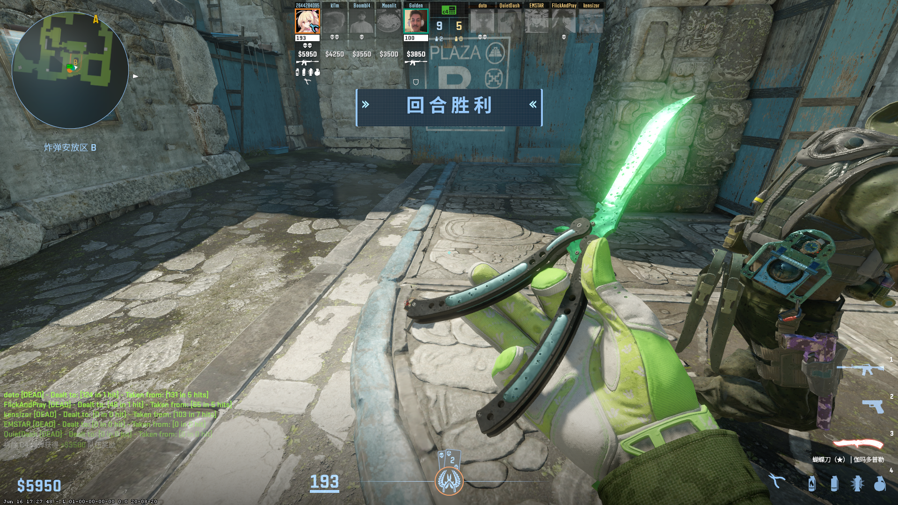
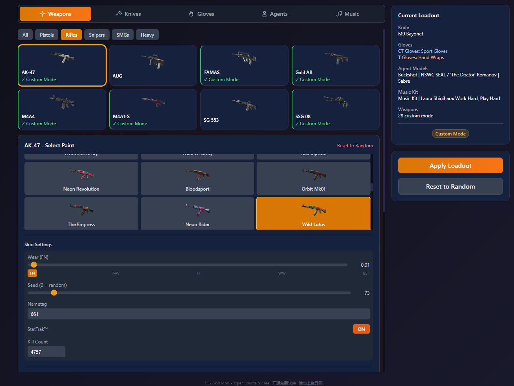

# CS2 Skin Mod

Локальный плагин для настройки скинов в Counter-Strike 2, позволяющий игрокам менять скины оружия, ножи, перчатки, модели агентов и музыкальные наборы.

**[English Documentation](README.md)** | **[中文说明](README_CN.md)**

## Демонстрация

Следующие скриншоты сделаны в локальных матчах с ботами с использованием плагина [CS2-Bot-Improver](https://github.com/ed0ard/CS2-Bot-Improver):

> CS2-Bot-Improver — это плагин для Counter-Strike 2, улучшающий прицеливание ботов, их передвижение, метание гранат, поведение, стратегии и т.д. Предназначен для улучшения опыта игры против ботов офлайн или с друзьями. Может быть установлен как на клиенте, так и на сервере.





[Нажмите, чтобы посмотреть больше скриншотов](./screenshots.md)

## Предупреждение о риске VAC

**ВАЖНО: Этот плагин изменяет файлы CS2 и требует параметр запуска `-insecure`.**

Хотя этот плагин:
- Изменяет только локальный клиентский рендеринг
- Не влияет на реальный инвентарь Steam
- Предназначен только для офлайн/локальной игры

**Использование любого стороннего ПО с CS2 несёт неотъемлемый риск.** Античит-система Valve (VAC) может обнаружить изменённые файлы игры. Авторы **НЕ несут ответственности** за возможные VAC-баны или ограничения аккаунта.

**Используйте на свой страх и риск.**

> **Совет по безопасности:** Для максимальной безопасности используйте дополнительный аккаунт Steam при локальной игре с этим плагином.

## Возможности

- **Скины оружия**: Настройка скинов для 30+ видов оружия
- **Ножи**: Выбор из 20 типов ножей с множеством вариантов раскраски
- **Перчатки**: 8 типов перчаток с множеством вариантов раскраски, настройка для каждой команды (CT/T отдельно), локализованные названия
- **Модели агентов**: 35 моделей CT + 44 модели T (локализованные названия: EN/ZH/JA/KO)
- **Музыкальные наборы**: 18+ музыкальных наборов с локализованными названиями
- **Брелоки/Чармы**: Крепление чармов на оружие с настраиваемым положением и seed
- **Именные ярлыки**: Установка пользовательских названий оружия
- **StatTrak**: Включение счётчиков убийств StatTrak с настраиваемым количеством
- **Случайный режим**: Случайный выбор скинов при каждом возрождении
- **Пользовательский режим**: Точный выбор каждого скина
- **Панель управления**: Нативное приложение Tauri для удобной настройки
- **Многоязычность**: English, 简体中文, 繁體中文, 日本語, 한국어, Русский

## Установка

### Предварительные требования

1. Установленная Counter-Strike 2
2. CounterStrikeSharp — панель автоматически определит и установит его при нажатии «Установить аддоны». Ручная установка не требуется.

### Шаг 1: Скачайте и установите панель

Скачайте последнюю версию для вашей платформы:
- Windows: `CS2-Skin-Mod_x.x.x_x64-setup.exe`
- Linux: `cs2-skin-mod-panel_x.x.x_amd64.AppImage`
- macOS: `CS2-Skin-Mod_x.x.x_aarch64.dmg`

Установите и запустите приложение.

### Шаг 2: Установка аддонов

1. Запустите CS2 Skin Mod Panel
2. Перейдите в **Настройки** (значок шестерёнки в правом верхнем углу)
3. Укажите путь к CS2 (например, `C:\Program Files (x86)\Steam\steamapps\common\Counter-Strike Global Offensive\game\csgo`)
4. Нажмите **«Установить аддоны»** — это автоматически установит CounterStrikeSharp (если отсутствует) и скопирует файлы плагина в папку CS2

### Шаг 3: Настройте параметры запуска CS2

1. Откройте Steam
2. Нажмите правой кнопкой мыши на Counter-Strike 2
3. Выберите «Свойства»
4. В «Параметрах запуска» добавьте: `-insecure`

**Предупреждение: Это не позволит вам играть на серверах, защищённых VAC.**

### Шаг 4: Настройте и играйте

1. Настройте экипировку в панели
2. Нажмите **«Применить»** для сохранения
3. Запустите CS2 с `-insecure` и начните локальный матч
4. Возродитесь в игре, чтобы увидеть свои скины

## Использование

### Быстрый старт

1. Запустите CS2 Skin Mod Panel
2. Перейдите в **Настройки** и укажите путь к CS2
3. Нажмите **«Установить аддоны»** для установки плагина
4. Настройте экипировку в панели
5. Нажмите **«Применить»** для сохранения
6. Запустите CS2 с `-insecure` и начните локальный матч
7. Возродитесь в игре, чтобы увидеть свои скины

### Внутриигровые команды

| Команда | Описание |
|---------|-------------|
| `skin_menu` | Перезагрузить экипировку из панели (используйте после изменения скинов в панели) |
| `skin_random` | Включить случайный режим скинов |
| `skin_reset` | Сбросить все скины на стандартные |

### Улучшенный опыт с ботами (Рекомендуется)

Для наилучшего опыта игры с ботами мы рекомендуем использовать [CS2-Bot-Improver](https://github.com/ed0ard/CS2-Bot-Improver) вместе с этим плагином. Поскольку панель автоматически устанавливает CounterStrikeSharp при развёртывании аддонов, CS2-Bot-Improver получит необходимый фреймворк — просто установите бот-плагин в папку аддонов CS2 для более умных и сложных ботов.

> **Совет:** Рекомендуем сначала установить наш плагин (который автоматически установит CounterStrikeSharp), а затем CS2-Bot-Improver.

### Как это работает

Панель и аддон обмениваются данными через JSON-файл (`player_loadout.json`):
1. **Панель** записывает вашу конфигурацию экипировки в папку плагина
2. **Аддон** читает этот файл при появлении игрока и применяет скины
3. Аддон отслеживает изменения файла и автоматически перезагружается при сохранении из панели

Плагин использует CounterStrikeSharp для перехвата оружейной системы CS2:
- Перехватывает вызовы `GiveNamedItem` для применения скинов при выдаче оружия
- Перехватывает `OnEntitySpawned` для обнаружения оружия, обошедшего хук GiveNamedItem
- Изменяет атрибуты `FallbackPaintKit`, `FallbackSeed` и `FallbackWear`
- Меняет модели ножей через ввод `ChangeSubclass`
- Заменяет модели агентов и перчатки при появлении игрока

Все изменения **только на стороне клиента** и не влияют на других игроков или сервер.

### Поддержка языков

Панель поддерживает несколько языков. Нажмите значок Настроек для переключения между:
- English
- 简体中文
- 繁體中文
- 日本語
- 한국어
- Русский

## Сборка из исходников

### Предварительные требования

- Node.js 18+
- Rust toolchain
- Tauri CLI

### Шаги сборки

```bash
# Клонируйте репозиторий
git clone https://github.com/emptysuns/CS2-Skin-Forge.git
cd CS2-Skin-Forge

# Установите зависимости фронтенда
cd Panel
npm install

# Соберите приложение Tauri
npm run tauri build
```

## Устранение неполадок

### Скины не отображаются

1. Убедитесь, что `-insecure` добавлен в параметры запуска
2. Убедитесь, что CounterStrikeSharp установлен (нажмите «Установить аддоны» в Настройках для автоматической установки)
3. Убедитесь, что в Настройках указан правильный путь к CS2
4. Нажмите «Установить аддоны», чтобы убедиться, что плагин установлен
5. Возродитесь после применения изменений
6. Проверьте консоль сервера на наличие ошибок

### Текстуры перчаток смещены или повреждены

Обычно это вызвано несоответствием между типом перчаток (DefIndex) и раскраской. Каждый тип перчаток (Bloodhound, Sport, Driver и т.д.) использует разную 3D-модель с собственной UV-развёрткой — применение раскраски, предназначенной для одного типа перчаток, к другому приводит к искажению текстур.

**Исправление:** При смене типа перчаток в панели раскраска автоматически сбрасывается на допустимое значение по умолчанию для этого типа. Если проблемы сохраняются:
1. Сначала выберите желаемый тип перчаток
2. Затем выберите раскраску из списка (панель показывает только допустимые раскраски для этого типа)
3. Нажмите «Применить» и возродитесь в игре
4. Если текстуры всё ещё повреждены, установите перчаткам «Случайный режим», примените, возродитесь, затем снова выберите нужные перчатки

### Панель не сохраняет экипировку

1. Убедитесь, что в Настройках правильно указан путь к CS2
2. Проверьте существование папки `addons/counterstrikesharp/plugins/PlayerSkinMod/`
3. Попробуйте снова нажать «Применить»

### Игра вылетает

1. Проверьте целостность файлов игры
2. Удалите конфликтующие плагины
3. Проверьте консоль CS2 на наличие ошибок

## Структура файлов

```
CS2-Skin-Forge/
├── addons/
│   └── counterstrikesharp/
│       └── plugins/
│           └── PlayerSkinMod/
│               ├── PlayerSkinModPlugin.cs  # Основной плагин
│               ├── PlayerSkinMod.csproj    # Проект C#
│               ├── Services/
│               │   ├── WeaponService.cs    # Применение скинов/перчаток/ножей
│               │   └── LoadoutService.cs   # Парсинг файла экипировки
│               ├── Data/
│               │   └── StaticData.cs       # Статические данные скинов/ножей/перчаток
│               ├── Models/
│               │   └── PlayerLoadout.cs    # Модель данных экипировки
│               ├── skins_en.json           # Данные скинов (англ. названия + флаги legacy)
│               └── player_loadout.json     # Экипировка (генерируется панелью)
├── Panel/
│   ├── src/                                # React фронтенд (с i18n)
│   ├── src-tauri/                          # Tauri бэкенд
│   └── package.json
├── .github/
│   └── workflows/
│       └── build.yml                       # Конфигурация CI/CD
├── README.md                               # Английская документация
├── README_CN.md                            # Китайская документация
└── README_RU.md                            # Этот файл
```

## Благодарности

- На основе [CS2-Bot-Improver](https://github.com/ed0ard/CS2-Bot-Improver) от ed0ard
- Применение скинов перчаток основано на [Nereziel/cs2-WeaponPaints](https://github.com/Nereziel/cs2-WeaponPaints)
- Использует [CounterStrikeSharp](https://github.com/roflmuffin/CounterStrikeSharp)
- Создано с помощью [Tauri](https://tauri.app/) + [React](https://react.dev/)

## Лицензия

GPL-3.0

## Отказ от ответственности

Это программное обеспечение предоставляется исключительно в **образовательных целях**. Используйте на свой страх и риск. Авторы не несут ответственности за:
- VAC-баны или ограничения аккаунта
- Вылеты или нестабильность игры
- Любые другие последствия использования этого ПО

Используя это программное обеспечение, вы подтверждаете, что понимаете связанные с ним риски.
